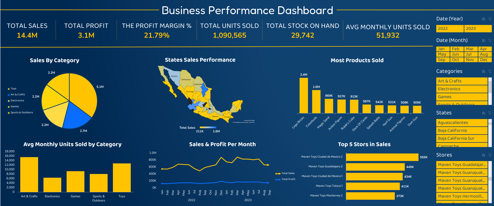

# 🧸 Maven Toys — Mexico Sales & Inventory Analysis

> **A full end-to-end business intelligence project** analyzing 1.09 million sales transactions across 50 toy stores in Mexico (Jan 2022 – Sep 2023).


---

## 📌 Project Overview

This project was completed as part of a data analysis college course. I was given a real-world-style dataset from **Maven Analytics** and tasked with building a complete analytics workflow — from raw CSV files to an executive-ready business report.

The dataset simulates a fictional Mexican toy retail chain called **Maven Toys**, with stores in 29 cities across 28 states. My goal was to uncover what was driving performance, what was hurting it, and what management should do next.

---

## 📊 Dashboard Preview


---

## 📂 Repository Structure

```
maven-toys-analysis/
│
├── data/
│   ├── sales.csv             # 829,256 transaction records (core fact table)
│   ├── products.csv          # 35 products with cost & price
│   ├── stores.csv            # 50 stores across 29 Mexican cities
│   ├── inventory.csv         # Stock-on-hand per store per product
│   └── geo.csv               # City → State → Country mapping
│
├── excel/
│   └── Data_Transformation.xlsx   # Pivot tables + Business Performance Dashboard
│
├── presentations/
│   ├── Maven_Toys_Report.pptx              # 10-slide business performance report
│   └── Maven_Toys_Dataset_Understanding.pptx  # 16-slide dataset & problem definition deck
│
└── README.md
```

---

## 🗂️ Data Source

| Field | Details |
|---|---|
| **Source** | [Maven Analytics — Data Playground](https://mavenanalytics.io/data-playground/mexico-toy-sales) |
| **License** | Public Domain — free to use, share, and modify |
| **Tables** | 5 CSV files |
| **Total Fields** | 25 columns across all tables |
| **Time Coverage** | January 2022 – September 2023 (21 months) |
| **Transaction Records** | 829,256 rows in `sales.csv` |

---

## 📊 Key Metrics (Overall)

| KPI | Value |
|---|---|
| Total Revenue | **$14.4M** |
| Total Profit | **$4.0M** |
| Overall Profit Margin | **27.8%** |
| Units Sold | **1,090,565** |
| Avg Monthly Units | **51,932** |
| Stock on Hand | **29,742 units** |
| Out-of-Stock Rate | **4.8%** |

---

## 🔍 Data Model

The five tables are joined as follows:

```
products.csv ──┐
               ├──→ sales.csv (fact table) ←──┬── stores.csv
inventory.csv ─┘                              └──→ geo.csv
                                               (via Store_City)
```

**Key relationships:**
- `sales.Product_ID` → `products.Product_ID` (many-to-one)
- `sales.Store_ID` → `stores.Store_ID` (many-to-one)
- `stores.Store_City` → `geo.City` (lookup)
- `inventory` bridges `Store_ID` + `Product_ID` (junction table)

**Derived metrics used throughout the analysis:**
```
Revenue  = Units × Product_Price
Cost     = Units × Product_Cost
Profit   = Units × (Product_Price − Product_Cost)
Margin % = Profit ÷ Revenue × 100
```

---

## 📈 Key Findings

### 1. Category Performance
| Category | Revenue | Profit | Margin % |
|---|---|---|---|
| Toys | $5.09M | $1.08M | 21.2% 🔴 |
| Art & Crafts | $2.71M | $0.75M | 27.8% 🟠 |
| Electronics | $2.25M | $1.00M | **44.6% 🟢** |
| Games | $2.23M | $0.67M | 30.3% 🟠 |
| Sports & Outdoors | $2.17M | $0.51M | 23.3% 🔴 |

> **Insight:** Electronics ranks 3rd in revenue but 1st in margin — it's the most profit-efficient category and is currently underinvested.

---

### 2. Regional Analysis
- **Ciudad de México** leads all states with **$1.65M** in revenue
- Top 3 states (CDMX, Nuevo León, Jalisco) account for **30% of total revenue**
- **Downtown** stores: 29 stores, $8.22M revenue (57% of total)
- **Airport** stores: only 3 stores, but average **$430K/store** vs $283K for Downtown

---

### 3. Sales Trend & Seasonality
- Revenue **peaks in December** (+32% vs November 2022 → $877K)
- A consistent **August dip** occurs every year:
  - Aug 2022: $489K (lowest month of 2022)
  - Aug 2023: $661K (–$168K vs July 2023)
- **March 2023** was the strongest single month at **$884K**

---

### 4. Root Cause Analysis — August 2023 Dip

> This follows the **Step 5** requirement: a granular, row-level investigation of a specific dashboard trend.

**Macro finding:** July 2023 ($828K) → August 2023 ($661K) = **–$167K drop (–20.2%)**

**Category-level breakdown:**
| Category | Revenue Drop | % Drop |
|---|---|---|
| Art & Crafts | –$51,567 | –24.9% |
| Toys | –$61,223 | –20.6% |
| Sports & Outdoors | –$30,168 | –23.4% |
| Games | –$20,515 | –19.1% |
| Electronics | –$3,998 | –4.5% |

**Product-level root cause: Lego Bricks**
- July 2023 average: **115 units/day**
- August 2023 average: **85 units/day**
- Worst single day (Aug 7): only **24 units** sold
- Pattern: Mid-week (Mon/Tue) consistently underperforms → points to a **replenishment cycle gap**, not a demand problem

---

### 5. Inventory Health
- 1,593 store-product combinations tracked
- **77 are out of stock** (Stock_On_Hand = 0)
- OOS rate: **4.8%**
- Given Lego Bricks' volume ($2.4M/year), even 1 week OOS = **~$9,000+ in missed revenue**

---

## 💡 Strategic Recommendations

| Priority | Recommendation | Estimated Impact |
|---|---|---|
| 🔴 HIGH | Fix August replenishment gap — automate reorder triggers 30 days before August | Recover ~$150K/year |
| 🔴 HIGH | Expand Electronics SKUs and shelf space; bundle with high-volume Toy products | Potential +$1.3M profit if share grows from 15.6% → 25% |
| 🟠 MEDIUM | Accelerate Airport store expansion — identify 5 new high-traffic airports | Est. +$2.15M annual revenue |
| 🟠 MEDIUM | Open stores in Sonora & Michoacán (29–33% margin states) to reduce concentration risk | Reduce top-3 state dependency from 30% → <22% |
| 🟢 LOW | Rationalize low-margin Toy SKUs in Commercial/Residential stores; shift shelf to Games | +1.5–2% margin uplift in Toys category |

---

## 🛠️ Tools & Methodology

| Step | Activity | Tool |
|---|---|---|
| 1. Data Collection | Downloaded and reviewed all 5 CSV files | Excel, Python |
| 2. Data Cleaning | Stripped `$` from prices, parsed dates, flagged OOS records | Python (pandas) |
| 3. Data Modeling | Joined all 5 tables on foreign keys | Python merge / Excel VLOOKUP |
| 4. Metric Creation | Derived Revenue, Profit, Margin %, monthly aggregates | Calculated columns |
| 5. Exploratory Analysis | Pivot tables by category, region, location type, month | Excel PivotTables / Python groupby |
| 6. Dashboard | Interactive visual summary of all KPIs | Excel |
| 7. Reporting | Structured business report + dataset understanding deck | PowerPoint |

---

## 📁 Deliverables

### Report Presentation (`Maven_Toys_Report.pptx`) — 10 Slides
1. Cover
2. Executive Summary (5 KPI cards + key bullet insights)
3. Category Analysis — Revenue & Margin
4. Category Analysis — Top 10 Products
5. Regional Analysis — States & Store Locations
6. Sales Trend Analysis — 21-Month Line Chart
7. **Root Cause Analysis** — Daily Lego Bricks breakdown (Aug 2023) + category drop bars
8. Key Insights — 6 numbered findings
9. Strategic Recommendations — 5 prioritized actions with impact estimates
10. Conclusion

### Dataset Understanding Presentation (`Maven_Toys_Dataset_Understanding.pptx`) — 16 Slides
1. Cover + Team Table
2. Table of Contents
3. Business Context
4. Where Did the Data Come From?
5. Dataset Structure & Snapshot
6. Data Model (ER Diagram)
7. What Does Each Row Represent?
8. Key Column Definitions
9. How the Tables Connect (traced join example)
10. Data Quality & Assumptions
11. Who Is the User?
12. What Is the Problem?
13. Problem Impact — Cost of Inaction
14. Recommended Analysis Questions
15. Analysis Methodology
16. Closing

---

## ⚠️ Data Limitations & Assumptions

- **Incomplete 2023 data:** Dataset ends in September 2023. Year-over-year comparisons use Jan–Sep only.
- **No customer data:** No customer IDs, demographics, or loyalty data — analysis is limited to product, store, and time dimensions.
- **Fictitious dataset:** Maven Toys is a fictional company. Findings are valid for analytical learning but not for real business decisions.
- **Currency:** All prices assumed to be in USD as labeled in the source data.
- **OOS assumption:** `Stock_On_Hand = 0` is treated as genuinely out of stock, with no imputation.

---

## 🙏 Acknowledgements

- Dataset provided by **[Maven Analytics](https://mavenanalytics.io)** via their free Data Playground
- Project completed as part of a college data analysis course

---

*Analysis Period: January 2022 – September 2023 | 50 Stores | 35 Products | 5 Categories | 1.09M Transactions*
